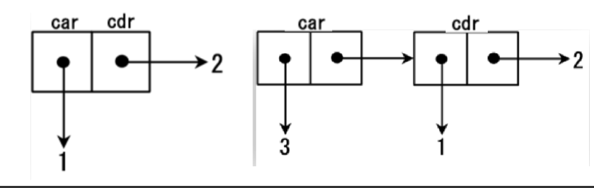

# Project 3: Scheme Interpreter

> SJTU CS1958-01 2025Fall 第三次大作业

请先阅读 [解释器简明教程](https://notes.sjtu.edu.cn/pzbJsIoKQbSwt66MZR-vdQ)，有兴趣可以阅读 [为什么 Lisp 语言如此先进？](https://www.ruanyifeng.com/blog/2010/10/why_lisp_is_superior.html):)

## 内容概述

简单来说，你需要实现一个 `Scheme` 解释器，`Scheme` 是一种函数式语言，它主要有两种特性：

- 采用 S- 表达式，除了 `Integer` 、`Boolean` 类型与变量 `var`，其余语法形如 `(expr exprs ...)`，例如 `(+ 1 3)`
- 函数也被视作一个变量

如果你对 `Scheme` 感兴趣，可以在网上自行查阅相关信息，譬如 [Scheme 拓展教程](https://joytsing.cn/posts/56075/#toc-heading-19)。本次大作业并不需要你实现 `Scheme` 所有的功能，因此阅读文档即可完成所有的需求。本文中涉及到的 `Scheme` 标准以 `R5RS` 为主，也加入了一些 `R6RS` 标准，可以通过 [R5RS 在线解释器](https://spritely.institute/hoot/) 和 `chez-scheme` 进行调试，对于文档中未说明的未定义行为，请与大作业发布者进行交流说明。

## 项目框架

### 编译

我们已经为你提供了 `CMakeLists.txt`， 要编译整个项目， 在根目录下输入

```
cmake -B build
cmake --build build --target code
```

之后， `code` 程序会生成在子目录 `bin` 下， 在根目录下执行

```
./code
```

来运行你的解释器。

### 代码实现

`src` 下文件为：

```
src
├── shared.hpp
├── parser.cpp
├── evaluation.cpp
├── main.cpp
├── Def.hpp
├── Def.cpp
├── syntax.hpp
├── syntax.cpp
├── expr.hpp
├── expr.cpp
├── value.hpp
├── value.cpp
├── RE.hpp
├── RE.cpp
├── expr.hpp
└── expr.cpp
```

其中 `parser.cpp` 和 `evaluation.cpp` 是你主要需要修改的文件；对于其他的文件， 它们的用处分别为

- `Def.hpp`： 声明需要用到的类型、枚举类型和辅助函数
- `Def.cpp`： 定义了辅助函数和两个 `map`， 其中 `primitive` 用来存 `library` 函数的关键字， `reserved_words` 存其他语法的关键字（希望这两个函数和枚举类型能对你有所帮助， 当然你也可以不用我们提供的工具自己实现所有的功能， it's up to you）
- `RE.hpp` 与 `RE.cpp`： 定义了需要报错时需要使用的异常类型， 你需要学习异常类型的使用， 具体可以看 [这里](https://www.runoob.com/cplusplus/cpp-exceptions-handling.html)
- `syntax.hpp` 与 `syntax.cpp`： 定义了所有的 `Syntax` 和 [子类](https://www.runoob.com/cplusplus/cpp-inheritance.html)， 具体实现在 `syntax.cpp` 中
- `expr.hpp` 与 `expr.cpp`： 定义了所有的 `Expr` 和子类， 子类的构造函数在 `expr.cpp` 中
- `value.hpp` 与 `value.cpp`： 定义了所有的 `Value` 和子类， 子类的构造函数和输出方式在 `value.cpp` 中； 此外， 我们提到的作用域， 被实现在 `Assoc` 和 `AssocList` 中， 具体可以参考这两个文件
- `main.cpp`： REPL 的执行部分；

在完成本次大作业的过程中，你可以修改任何相关的代码，比如当你处理 `VoidV` 时，很可能会涉及对 `main.cpp` 的修改.

### 评测

在 [ACM OJ](https://acm.sjtu.edu.cn/OnlineJudge/problem/2788) 上进行提交测评， 我们也会下发部分数据来帮助你在本地进行调试。

具体而言， 你只需要在代码提交页面输入 `git` 仓库的地址。

### 调试

在完成编译后，你可以运行你的解释器，并自行输入 Scheme 语言，检查你的解释器行为是否符合预期。

同时，我们在 `repo` 中提供了评测程序来对你的解释器进行本地测评， 评测程序在子目录 `score` 下， 评测数据在子目录 `score/data` 下。

具体而言， 评测程序会执行你的解释器并将结果与标准程序的输出进行比对， 要使用评测程序， 在子目录 `score` 下执行以下命令即可

```
./score.sh
```

若权限不够， 你可以输入下列命令后再执行

```
chmod +x score.sh
./score.sh
```

脚本中有两行

```
L = 1
R = 119
```

你可以将这两个变量改为任意数字来对给定范围内的测试点进行测评。

请合理利用本地的评测程序进行调试。

## 帮助

- 本次大作业中涉及到了大量的继承、虚函数相关的 C++ 语法，请你在开始做大作业前确保自己对这些概念有一定的认知
- 你需要了解如何使用 `dynamic_cast` 函数来实现基类指针与派生类指针的转换
- 本次大作业不需要考虑内存泄漏
- 如有文档中未涉及到的问题，请与大作业发布者联系

## 任务

本项目分为 `Basic`, `Extension` 两部分，其中，`Basic` 建议按照顺序完成，因为前后板块之间有依赖关系；在完成***所有 `Basic` 部分***后你才能启动 `Extension`，并且部分 `Extension` 可能需要完成前置 `Extension`，具体说明请见下文。为了提高选择的自由性，你可以任意选择你想要完成的解释器部分，本部分最高你可获得 `125pts` 的分数;

以下为了行文流畅，笔者按照功能讲解，`Basic` 与 `Extension` 的划分详见文末，请注意前后功能的依赖性；

---

### Subtask 1：基本算术操作与比较运算符

#### 任务概述

- `Basic`(`10pts`): 完成支持有理数和整数类的二元四则运算与比较运算符，并支持表达式的嵌套；
- `Extension`(`15pts`)：完成支持有理数和整数类的任意个参数的四则运算与比较运算符，并支持表达式的嵌套

注: 大家不要管溢出的问题，统一用 `int` 就行了

#### 涉及类型

在本次大作业中，你将会涉及以下几个基本类型：


| 表达式      | 含义     | 解释                                                                                                        |
| ----------- | -------- | ----------------------------------------------------------------------------------------------------------- |
| `Integer`   | 整数类   | 行为类似 `int`,用 `number?` 判断返回 `#t`                                                                   |
| `Rational`  | 分数类   | 无 ,用 `number?` 判断返回 `#f`                                                                              |
| `Boolean`   | 布尔类   | 只有 `#t` 和 `#f` 两种结果，对应 `true` 与 `false`，用 `boolean?` 判断                                      |
| `String`    | 字符串类 | 行为类似 `string`,输入时用 `""` 标记，用 `string?` 判断                                                     |
| `Symbol`    | 符号类   | 行为类似 `enum`，视为不可变的字符串，用 `symbol?` 判断                                                      |
| `Pair`      | 表类     | 可递归式储存二元对从而储存表，用 `pair?` 判断                                                               |
| `Null`      | 空类     | 空表 (`'()`)，用 `null?` 判断                                                                               |
| `Terminate` | 终止类   | `(exit)` 的值类型                                                                                           |
| `Void`      | 过程类   | 表示所有没有副作用的函数，包括 `(begin),(void),set!,display` 等，我们要求除了 `(void)` 之外其他命令不输出 `#<void>` |
| `Procedure` | 函数类   | 用来表示函数的闭包，用 `procedure?` 判断                                                                    |

我们已经为你实现了所有的类型处理与类型判断，在 `Subtask 1` 中，你将会接触到 `Integer` 与 `Boolean`.

类型判断demo:

`(number? expr)`、`(boolean? expr)`、`(null? expr)`、`(pair? expr)`、`(symbol? expr)` 分别表示 `expr` 的值的类型是否为 `Integer`、`Boolean`、`Null`、`Pair`、`Symbol`。它们接受一个任意类型的参数，值为对应的结果，类型为 `Boolean`。

`(eq? expr1 expr2)` 表示检查 `expr1` 与 `expr2` 的值是否相等。该表达式接受两个任意类型的参数，值为对应的结果，类型为 `Boolean`。具体的比较规则：

- 若两个参数的类型都为 `Integer`，则比较对应的整数是否相同
- 若两个参数的类型都为 `Boolean`，则比较对应的布尔值是否相同
- 若两个参数的类型都为 `Symbol`，则比较对应的字符串是否相同
- 若两个参数的类型都为 `Null` 或都为 `Void`，则值为 `#t`
- 否则，比较两个值指向的内存位置是否相同（例如两个 `Pair`，即使它们左右值都相等，但如果内存位置不同，我们也认为两者不同）

我们提供的接口中存的是指向值的指针而非值本身， 你可以通过定义 `Value v` 并使用 `v.get()` 来查看 `v` 指向的内存位置。

样例：

```
scm> (not #f)
#t
scm> (not (void))
#f
scm> (pair? (car (cons 1 2)))
#f
scm> (symbol? (quote var))
#t
scm> (number? (+ 5 1))
#t
scm> (null? (quote ()))
#t
scm> (eq? 3 (+ 1 2))
#t
scm> (eq? #t (= 0 0))
#t
scm> (eq? (quote ()) (quote ()))
#t
scm> (eq? (quote (1 2 3)) (quote (1 2 3)))
#f
scm> (define str "hello")/*这里报错，需要修改*/
scm> (eq? str str)
#t
scm> (eq? "hello" "hello")
#f
scm> (eq? 1 1)
#t
```

#### 基本算术操作

在真实的 `Scheme` 中，`+`、`-`、`*` 和 `/` 分别代表加、减、乘、除,而且接受整数和分数的处理,如果传入参数中有分数，那么结果按照最简分数或整数形式表示；例如：

```scheme
(- 10 3)    ;->7
(* 2 3)     ;->6
(/ 29 3)    ;->29/3
(/ 9 6)     ;->3/2
(/ 1 0)     ;->RuntimeError
(+ 1/2 1)   ;->3/2
```
括号可以像下面这样嵌套：

```scheme
(* (+ 2 3) (- 5 3)) ;-> 10
(/ (+ 9 1) (+ 2 3)) ;-> 2
(+ (/ 1 2) (+ 1 1)) ;->5/2
```

也支持任意个参数：
```scheme
;;0 parameter: (+) → 0;(*) → 1;(-)→ RuntimeError;(/)→ RuntimeError
;;1 parameter: (+ x) → x;(* x) → x;(- x) → -x;(/ x) → 1/x
;;2 parameter: also right;
;;more parameters:
(+ 2 3 4) ;-> 9
(- 2 3 4) ;-> -5
(* 2 3 4) ;-> 24
(/ 2 3 4) ;-> 1/6
```

注意这里的 `+`、`-`、`*` 和 `/` 实际都是某种函数；在 `evaluation.cpp` 中已经提供了 `modulo`,`expt` 供参考二元函数的具体实现方式; 分数类的实现可参见 `Rational` 类，任意参数的实现可参见 `Variadic` 类.

#### 比较运算符

在真实的 `Scheme` 中，`>`、`>=`、`<`、`<=` 和 `=` 中不仅是二元的，也应当支持两个及以上的参数。当传入参数是按照函数名称排序时返回 `#t`，反之返回 `#f`；

```scheme
(= 1 1)      ;Value: #t 
(< 1 2)      ;Value: #t 
(= 2 2 2)      ;Value: #t 
(< 2 3 4)      ;Value: #t 
(> 4 1 -1)     ;Value: #t 
(<= 1 1 1)     ;Value: #t 
(>= 2 1 1)     ;Value: #t 
```
我们在 `evaluation.cpp` 中已经提供了 `modulo`,`expt` 供参考二元函数的具体实现方式; 分数类的实现可参见 `Rational` 类，任意参数的实现可参见 `Variadic` 类; 我们还额外提供了 `compareNumericValues` 函数用来帮助你快速比较有理数与整数，当然你也可以选择自己实现它们:)

----

### Subtask 2：元组与列表

#### 任务概述

- `Basic`(`10 pts`): 完成对于元组与列表基本命令 (`cons`,`car`,`cdr`) 的处理；正确实现 `quote` 命令的处理；
- `Extension`(`10 pts`)：完成 `list` 与 `list?` 命令; 完成 `set-car!` 与 `set-cdr!`，这部分讲解见后文 `Subtask5` 中的 `set！` 部分；

#### 涉及类型
在 `Subtask 2` 中，你将会接触到除 `Procedure` 外的所有类型.

#### 元组与列表

在 `Scheme` 中，我们用形如 `(A . B)` 的形式表示一个二元数对；而像这样的二元数对我们一般通过 `(cons A B)` 的形式生成；譬如下图就分别表示 `(cons 1 2)` 与 `(cons 3 (cons 1 2))`.其中每个二元数对的首和尾用 `car` 和 `cdr` 表示.



当然 `(cons A B)` 中 `A B` 的类型完全可以是不同的，也可以嵌套命令：

```scheme
(cons 'a (cons 3 "hello"))
;;Value : (a 3 . "hello")
(cons (cons 0 1) (cons 2 3))
;;Value : ((0 . 1) 2 . 3)
;;THINKING: WHY NOT (0 1 2 . 3)?
```

通过嵌套命令，我们很容易就发现我们可以通过 `cons` 的嵌套实现列表 (`list`)，比如下图就是列表 `(1 2 3)` 的实现；


可见其本质是一个从 `'()` 开始递归构造的 `Pair` 链.

除此之外，我们要求支持一些命令：

#### 基本命令

`car` 与 `cdr` 函数用以返回一个 `Cons` 单元的 `car` 部分和 `cdr` 部分。如果 `cdr` 部分串连着 `Cons` 单元，解释器会打印出整个 `cdr` 部分,直至最后一个元素；

```Scheme
(car '(1 2 3 4))
;Value: 1
(cdr '(1 2 3 4))
;Value: (2 3 4)
(car (cons 5 #f))
;;Value: 5
(cdr (cons #t (void)))
;;Value: #<void>
(cdr (quote ((ll . lr) . (rl . rr))))/*这里错了,需要修改,怀疑是quote的问题*/
;;Value: (rl . rr)
(car (quote (+ - *)))
;;Value: +
```

`list` 函数使得我们可以构建包含数个元素的表，其支持任意个数的参数，且返回由这些参数构成的表；`list?` 函数用来判别其是否是一个 `list`,注意 `'()` 的特殊判别情形.

```scheme
(list)
;Value: ()
(list 1)
;Value: (1)
(list '(1 2) '(3 4))
;Value: ((1 2) (3 4))
(list 0)
;Value: (0)
(list 1 2)
;Value: (1 2)
(list? '())
;Value: #t
(list? '(1 2 3))
;Value: #t
(pair? '())
;Value: #f
(list? (cons 1 2))            
;Value: #f
(list? (cons 1 (cons 2 '()))) 
;Value: #t
```

#### 引用 (`quote`)

在 `Scheme` 中，所有记号都会从最内层的括号依次向外层括号求值，且最外层括号返回的值将作为 S- 表达式的值。但被称为引用（`quote`）的形式可以用来阻止记号被求值。它是用来将符号或者表原封不动地传递给程序，而不是求值后变成其它的东西。例如，``(+ 2 3)`` 会被求值为 `5`，然而 `(quote (+ 2 3))` 则向程序返回 `(+ 2 3)` 本身。因为 `quote` 的使用频率很高，他被简写为 `'`。

比如：

```scheme
;;’(+ 2 3)代表列表`(+ 2 3)`本身；
;;’+代表符号`+`本身；
;;’()是对空表的引用，也就是说，尽管解释器返回`()`代表空表，你也应该用`’()`来表示空表

(quote 1)         ;;1 // Integer 
(quote #t)        ;;#t // Boolean 
(quote (+ 1 2 3)) ;;(+ 1 2 3) // List
(quote (4 . 5))   ;;(4 . 5) // Pair
(quote scheme)    ;;scheme // Symbol 
```

其中我们要求如果 `quote` 的对象是一个 `Pair`，我们要求其输出形式满足 `(A B . C)` 的形式，即:
- 点符号只能出现一次
- 点符号必须在倒数第二个位置
- `(a . b . c)` 是非法的
- `(a .)` 是非法的

这一部分不一定很好理解，大家可以借助下面的样例思考：

```scheme
(quote (1 2 . 3))                     ;;Value:(1 2 . 3)
(quote (1 2 3))                       ;;Value:(1 2 3)
(quote (1 . (2 . 3)))                 ;;Value:(1 2 . 3)/*这里错了*/
(quote (1 . (2 . (3 . ()))))          ;;Value:(1 2 3)/*这里错了*/
(quote (quote (1 2)))                 ;;Value:(quote (1 2))
(car (quote ((1 . 2) 3 . 4)))         ;;Value:(1 . 2)
(cdr (quote ((1 . 2 ) 3 . 4)))        ;;Value:(3 . 4)
(quote (quote () 1 2 . (4 . 2)))      ;;Value:(quote () 1 2 4 . 2)/*这里错了*/
(car (quote (quote () 1 2 . (4 . 2))));;Value:quote
(cdr (quote (quote () 1 2 . (4 . 2))));;Value:(() 1 2 4 . 2)
```
//quote对于pair的处理存在问题，待修改
----

### Subtask 3：顺序执行，布尔值处理与条件语句

#### 任务概述

- `Basic`(`15 pts`): 完成对于顺序执行指令 (`begin`) 的处理；正确实现对逻辑运算符 (`and`,`or`,`not`) 命令的处理；正确实现条件语句 (`if`) 语句；
- `Extension`(`5 pts`)：正确实现 `cond` 语句.

#### 涉及类型
在 `Subtask 3` 中，你将会接触到除 `Procedure` 外的所有类型,主要接触 `Boolean` 类型.

#### 布尔运算符

这里涉及的运算符为 `not`,`and` 和 `or`.

`not` 是一元运算符，格式为 `(not expr)`，在对 `expr` 中的表达式求值后取反；行为同 `C++` 中的 `not`;

`and` 具有任意个数的参数，并从左到右对它们求值。如果某一参数为 `#f`，那么它就返回 `#f`，而不对剩余参数求值。反过来说，如果所有的参数都不是 `#f`，那么就返回最后一个参数的值。

`or` 具有可变个数的参数，并从左到右对它们求值。它返回第一个不是值 `#f` 的参数，而余下的参数不会被求值。如果所有的参数的值都是 `#f` 的话，则返回最后一个参数的值。

请特别注意，在 `scheme` 中，任何不同于 `#f` 的值（包括不同类型的值,包括 `'()`）都会被视作 `#t`。

请注意 `and` 与 `or` 都具有短路性质，即遇到符合要求的布尔表达式后，如果其后有非法表达式，是不需要报错的。即形如 `(and #f (/ 1 0))` 的式子是合法的.

```scheme
(not (> 1 2))
;;Value: ;;Value: #t
(not (< 1 2))
;;Value: #f
(not 5)
;;Value: #f
(and)
;Value: #t
(and 1 2 3)
;Value: 3
(and 1 2 3 #f)
;Value: #f
(or)
;Value: #f
(or 1 2 3)
;Value: 1
(or #f 1 2 3)
;Value: 1
(or #f #f #f)
;Value: #f
```
#### `if` 语句

在 `scheme` 中，`if` 语句的格式如下：

```Scheme
(if predicate then_value else_value)
```
如果 `predicate` 部分为真，那么 `then_value` 部分被求值，否则 `else_value` 部分被求值，并且求得的值会返回给 `if` 语句的括号外。请特别注意，在 `scheme` 中，任何不同于 `#f` 的值（包括不同类型的值,包括 `'()`）都会被视作 `#t`。

请注意 `if` 具有短路性质，如果其不求值的分支涉及非法表达式是不需要报错的.

```scheme
(if 0 1 2)
;;Value: 1
(if (< 2 1) #f #t)
;;Value: #t
(if (void) undefined 1)
;;Value: RuntimeError
(if #f undefined 1)
;;Value: 1
(if #t 1 (+ 1))
;;Value: 1
(if "hello" 1 2)
;;Value: 1
(if #t 'true-branch (/ 1 0))
;;Value: true-branch
(if #f (/ 1 0) 'false-branch)
;;Value: false-branch
```

#### `cond` 语句

类似于 `switch-case`，`cond` 语句用以简化嵌套的 if 表达式，格式如下：

```Scheme
(cond
  (predicate_1 clauses_1)
  (predicate_2 clauses_2)
    ......
  (predicate_n clauses_n)
  (else        clauses_else))
```

在 `cond` 表达式中，`predicates_i` 是按照从上到下的顺序求值，而当 `predicates_i` 为真时，`clause_i` 会被求值并返回。`i` 之后的 `predicates` 和 `clauses` 不会被求值。如果所有的 `predicates_i` 都是假的话，则返回 `clause_else`。在一个子句中，你可以写数条表达式，而 `clause` 的值是最后一条表达式( 注意 `cond` 同样遵循短路求值的特性); 特别地，如果没有匹配的分支，则返回 `VoidV()`；如果对于单条件分支只有条件没有分支 (比如 `(cond (#t))`)，那么返回条件值；比如 ` (cond (else 1) (#t 2))` 输出 `1`;

#### `begin` 语句

``(begin expr*)`` 表示 ``scheme`` 中的顺序结构，`expr* ` 表示可能 `0,1,2,⋯ ` 个 `expr`。你需要从左至右依次执行 `expr`，而 ``(begin expr*)`` 的值为最右侧的 `expr` 的值,注意这些 `expr` 内可能包含非法情况。

```scheme
(begin 1)
;;Value: 1
(begin (void) (cons 1 2) #t)
;;Value: #t
```

----

### Subtask 4：变量与函数

#### 任务概述

- `Basic`(`20 pts`): 完成对于 `var` 指令的处理；完成对于 `lambda` 指令对函数声明的处理; 完成 `define` 对变量与函数的基本定义以及一元递归处理；
- `Extension`(`10 pts`)：实现嵌套定义与词法闭包，这部分依赖于赋值语句的介绍，所以介绍放在 `Subtask 5` 末.

#### 涉及类型

在 `Subtask 4` 中，你将会接触到 `Procedure` 类型,这一部分在理解上会有较大难度，请仔细阅读本节内容与前文“解释器简明教程”一节.

#### 变量 (`var`)
/*关键问题所在，var的eval处理不正确*/
在本节我们认为，任何 `SymbolSyntax` 都可以被解释成 `var`，包括 `primitives` 与 `reserve_words` 中的字符串，例如 `+` 与 `quote` 也可以是变量名 (注意这仅限于 `Var::eval()`，后文的 `Define`、变量绑定一节对此的要求均有所差别)；这里我们要求：

1. 变量名可以包含大小写字母（`Scheme` 对大小写敏感）、数字以及 ``?!.+-*/<=>:$%&_~@`` 中的字符。在本次大作业中，我们规定：
2. 变量名的第一个字符不能为数字或者 ``.@ ``
3. 如果字符串可以被识别为一个数字，那么它会被优先识别为数字，例如 `1、-1、+123`
4. 当该变量在当前作用域未定义时，你的解释器应当输出 `RuntimeError`
5. 变量名可以与 `primitives`、`reserve_words` 重合
6. 变量名中的字符可以为除了 ``#``、``'``、``"``、` 任意非空白字符，但第一个字符不能为数字

```Scheme
undefined ;;Value: undefined 变量在当前作用域未定义
;;Value: RuntimeError
+ ;;Value: + 作为 primitive，是一个函数
;;Value: #<procedure>
((if #t + -) 1 2) ;;Value: (if #t + -) 的值为 +，然后调用进行函数调用
;;Value: 3
```
#### 函数的声明与调用

在 `scheme` 中用 `lambda` 语句声明函数，其格式为 `(lambda parameters procedure)`,具体输出是返回一个 `ProcedureV(parameters,e,env)` 的闭包,这样就构成了一个函数的声明，如:

```Scheme
(lambda (x y) (+ x y))
;;Value: #<procedure>
(lambda () (void))
;;Value: #<procedure>
(lambda (void) undefined)
;;Value: #<procedure>
```

但是这样仅仅构成了声明，而没有调用；正如《解释器的简明教程》一文中介绍的 `(func args...)` 的 `Apply::eval` 这里其实并没有引入新的语法，只是用自定义的 `lambda` 表达式替代了 `primitive` 的应用。

我们要求你支持新的语法 `((lambda (arg1....argn) procedure) var1....varn)`,你需要将 `var1....varn` 传入 `arg1....argn` 并代入 `procedure` 中求值: 譬如:

```Scheme
(((lambda (+) +) *) 2 3)
;;Value: 6
((lambda (x y) (* x y)) 10 11)
;;Value: 110
```

注意这里的 `procedure` 如果包含多个表达式，你需要从左到右依次执行.

#### 变量与函数的定义

在 `Scheme` 中，使用 `define` 来将一个符号与一个值绑定。你可以通过这个操作符定义例如数、字符、表、函数等任何类型的全局参数。

```Scheme
; Hello world as a variable
(define vhello "Hello world")     

; Hello world as a function
(define fhello (lambda ()         
         "Hello world"))
```

`define` 接受两个参数,它会使用第一个参数作为全局参数，并将其与第二个参数绑定起来。因此，代码片段 1 的第 1 行中，我们声明了一个全局参数 `vhello`，并将其与 `"Hello，World"` 绑定起来; 紧接着，在第 2 行声明了一个返回 `“Hello World”` 的过程。

在解释器中输入 `vhello`，解释器返回 ``“Hello，World”``; 如果你在解释器中输入 `fhello`，它返回 `#<procedure>`; 如果把 `fhello` 当过程对待，你应该用括号括住这些符号，比如 `(fhello)`,然后求值并返回 `"Hello World"`。

简单来说，你需要支持:

1. 变量的定义；要求同 `var`，而且不允许与 `primitives` 与 `reserve_words` 重名；而且支持同一变量的重命名;
 
2. 简单函数的定义,要求支持以下语法形式:
 
 ```Scheme
 (define sum3 (lambda (a b c)(+ a b c)))
 ```
 
 以及其简写形式:
 
 ```Scheme
 (define (sum3 a b c)
   (+ a b c))
 ```
3. 对一元简单递归函数的处理; 为此，你需要先在环境中创建一个占位符绑定，然后计算表达式的值，最后将更新绑定为实际值

```Scheme
(define (fact n)
  (if (= n 1)
      1
      (* n (fact (- n 1)))))
```

递归在 `Scheme` 中常用来表示重复；表是被递归定义的，进而表和递归函数可以很好地配合。例如，一个让表中所有元素翻倍的函数可以像下面这样写。如果参数是空表，那么函数应该停止计算并返回一个空表。

```Scheme
(define (list*2 ls)
  (if (null? ls)
      '()
      (cons (* 2 (car ls))
             (list*2 (cdr ls)))))
```

上述过程中，我们保证所有的 `define` 都在全局环境中；不会出现 `define` 内嵌套在 `begin`,`define`,`let` 等可能出现创建局部环境的情况.

注意这里的第二个参数如果包含多个表达式，你需要从左到右依次执行.

----

### Subtask 5：变量的绑定与赋值

#### 任务概述

本部分全部都是 `Extension`,包括:
- `let` 和 `letrec`(`20pts`)
- `set!`(`10pts`)
- `Subtask 2` 中的 `set-car!` 与 `set-cdr!` 介绍，`Subtask 4` 中的嵌套定义与词法闭包介绍.

#### 涉及类型

在 `Subtask 5` 中，你将会接触到所有类型,这一部分在理解上会有较大难度，请仔细阅读本节内容与前文“解释器简明教程”一节.

#### `let` 表达式

在 `Scheme` 中使用 `let` 表达式可以定义局部变量。格式如下：

```Scheme
(let ((p1 v1) (p2 v2) ...) body)
```
在这一过程中,声明了变量 `p1、p2、...`，并分别为它们赋初值 `v1、v2、...`（`v1 v2...` 可以是表达式）；`body` 由任意多个 S- 表达式构成。变量的作用域为 `body`.`let` 表达式的结果是在 `body` 中对 `body` 内的表达式进行求值; 注意这里的 `body` 如果包含多个表达式，你需要从左到右依次执行.

本质上，
```Scheme
(let ((p1 v1) (p2 v2) ...) body)
```
只是
```Scheme
((lambda (p1 p2 ...) body) v1 v2 ...)
```
的语法糖.例如:

例 1：声明局部变量 `i` 和 `j`，将它们与 `1、2` 绑定，然后求二者的和。

```Scheme
(let ((i 1) (j 2)) (+ i j))
;Value: 3
```
`let` 表达式可以嵌套使用。

例 2：声明局部变量 `i` 和 `j`，并将分别将它们与 `1` 和 `i+2` 绑定，然后求它们的乘积。

```Scheme
(let ((i 1))
  (let ((j (+ i 2)))
    (* i j)))
;Value: 3
```
由于变量的作用域仅在 `body` 中，下列代码会产生错误，因为在变量 `j` 的作用域中没有变量 `i` 的定义。

```Scheme
(let ((i 1) (j (+ i 2)))(* i j))
;;Error
```
例 3：你应当正确实现变量在内层与外层的覆盖，譬如下式应当输出 `inner` 而非 `outer`。
```Scheme
(let ((x (quote inner)))
	(let ((func (lambda () x)))
      	(let ((x (quote outer))) (func))))
;;Value: inner
```
例 4: 这里的变量绑定与 `var` 要求相同，支持 `primitives` 与 `reserved_words`;
```Scheme
(let ((+ 1)) +)
;;Value: 1
(let ((+ -)) (+ 2 1))
;;Value: 1
(let ((+ 1)) +) ;;Value: + 在 let 中的作用域内是一个变量，它对应的值为 1
;;Value: 1
(let ((x (lambda (y) y))) x)
;;Value: #<procedure>
```

#### `letrec` 表达式

`letrec` 类似于 `let`，但它允许一个名字递归地调用它自己。语法 letrec 通常用于定义复杂的递归函数。下文展示了 `fact` 函数的 `letrec` 版本。

我们尝试用 `let` 语法实现一个求阶乘的递归函数 `fact`：

```scheme
(let
	((fact
      	(lambda (n)
          	(if (= n 0)
				1
                (* n (fact (- n 1)))))))
	(fact 5))
```

考虑 `fact` 这一 `Closure` 内部的作用域，可以发现该作用域并不包含 `fact`，于是上述表达式会得到 `RuntimeError`。

这就是 `let` 语法的不足，它不支持我们在求 `var` 的值时调用别的 `var`。

我们来看 `letrec` 是如何解决这一问题的：首先在当前作用域的基础上创建一个新作用域 `env1`，将 `var*` 与 `Value(nullptr)`（表示定义了该变量，但无法使用）绑定并引入 `env1`；然后在 `env1` 下对 `expr*` 求值，并在 `env1` 的基础上创建一个新作用域 `env2`，将 `var*` 与其对应的值绑定并引入 `env2`；最后在 `env2` 下对 `expr*` 求值，并更新 `env2` 中的变量绑定，在 `env2` 中对 `expr` 进行 `eval`。

你可能会好奇“定义了该变量但无法使用”跟不定义这个变量有什么区别，确实，在这种情况

```scheme
(letrec
	((a 1)
     (b a))
	b)
```

下并没有用，因为变量 `a` 虽然被定义但无法使用，你的解释器仍然应该输出 `RuntimeError`。但如果 `b` 绑定的是个 `Closure` 呢？例如

```scheme
(letrec
	((a 1)
     (b (lambda () a)))
	(b))
```

，此时你的解释器应该输出 `1`。因为 `(lambda () a)` 是个 `Closure`，我们并不会在定义时对它的函数体 `a` 执行与求值，所以解释器不会报错；而当我们真正对 `a` 求值时，所处的作用域 `env2` 里变量 `a` 对应的值即为 `1`，因此没有任何问题。

在这种情况下 `letrec` 实现的 `fact` 为:

```Scheme
(letrec ((fact (lambda (n) 
                 (if (<= n 1) 1 
                     (* n (fact (- n 1)))))))
  (fact 5))
```
语法 `letrec` 是定义局部变量的俗成方式。

#### 赋值 (`set!`,`set-car!`,`set-cdr!`)

因为 `Scheme` 是函数式语言，通常来说，你可以编写不使用赋值的语句。然而，如果使用赋值的话，有些算法就可以轻易实现了。尽管赋值非常习见并且易于理解，但它有一些本质上的缺陷 (参见《`SICP`》的第三章第一节“赋值和局部状态”以及《为什么函数式编程如此重要》)。

特别的，在 `Scheme` 中，由于赋值改变了参数的值，因此它具有破坏性（`destructive`），所以以 `!` 结尾，以警示程序员。本次大作业你需要实现的是 `set!`,`set-car!` 与 `set-cdr!`.

`set!` 可以为一个参数赋值,且在赋值前参数应被定义.

```Scheme
(define var 1)
(set! var (* var 10))
;;var ⇒ 10

(let ((i 1))
    (set! i (+ i 3))
    i)
;;⇒ 4
```

函数 `set-car!` 和 `set-cdr!` 分别为一个 `cons` 单元的 `car` 部分和 `cdr` 部分赋新值; 和 `set!` 不同，这两个操作可以为 `S`- 表达式赋值。

```Scheme
(define tree '((1 2) (3 4 5) (6 7 8 9)))

(set-car! (car tree) 100)  ; changing 1 to 100 

tree
;;Value: ((100 2) (3 4 5) (6 a b c))
```

#### 嵌套定义的实现
 
对于一元递归的实现是简单，现在我们希望你能够实现形如下文的嵌套定义:
 
```Scheme
(define (is-even n)
  (cond
   ((= n 0) #t)
   (else (is-odd (- n 1)))))

(define (is-odd n)
  (cond
   ((= n 0) #f)
   (else (is-even (- n 1)))))
```

#### 词法闭包的实现
你可以使用词法闭包来实现带有内部状态的过程。例如，用于模拟银行账户的过程可以按如下的方式编写：初始资金是 `10` 美元。函数接收一个整形参数。正数表示存入，负数表示取出。为了简单起见，这里允许存款为负数。

```Scheme
(define bank-account
  (let ((balance 10))
    (lambda (n)
      (set! balance (+ balance n))
      balance)))
```
该过程将存款赋值为 `(+ balance n)`。下面是调用这个过程的结果。

```Scheme
(bank-account 20)     ; donating 20 dollars 
;Value: 30
(bank-account -25)     ; withdrawing 25 dollars
;Value: 5
```                         
因为在 `Scheme` 中，你可以编写返回过程的过程，因此你可以编写一个创建银行账户的函数。这个例子喻示着使用函数式程序设计语言可以很容易实现面向对象程序设计语言。实际上，只需要在这个基础上再加一点东西就可以实现一门面向对象程序设计语言了。

```Scheme
(define (make-bank-account balance)
  (lambda (n)
    (set! balance (+ balance n))
    balance))
(define gates-bank-account (make-bank-account 10))   ; Gates makes a bank account by donating  10 dollars
;Value: gates-bank-account

(gates-bank-account 50)                              ; donating 50 dollars
;Value: 60

(gates-bank-account -55)                             ; withdrawing 55 dollars
;Value: 5


(define torvalds-bank-account (make-bank-account 100))  ; Torvalds makes a bank account by donating 100 dollars
;Value: torvalds-bank-account

(torvalds-bank-account -70)                             ; withdrawing 70 dollars
;Value: 30

(torvalds-bank-account 300)                             ; donating 300 dollars
;Value: 330
```

综上，你需要完成的 `Basic` 与 `Extension` 为:

| `Basic/Extension` | 语法形式         | 要求                                           | 分值    |
| ----------------- | ---------------- | ---------------------------------------------- | ------- |
| `Basic`           | 四则运算与关系符 | 二元，支持嵌套，支持整数类与有理数类           | `10pts` |
| `Basic`           | `quote`          | 见上文                                         | `5pts`  |
| `Basic`           | 元组与数对       | 支持 `pair`,`cons`,`car`,`cdr`                 | `5pts`  |
| `Basic`           | `begin`          | 支持顺序执行，详见上文                         | `5pts`  |
| `Basic`           | 布尔值相关       | `and`,`or`,`not`,`if`                          | `10pts` |
| `Basic`           | 变量与函数声明   | `var`,`lambda`,`Apply`                         | `10pts` |
| `Basic`           | `Define`         | 变量与函数的基本声明，一元递归定义，不含内嵌套 | `10pts` |
| `Extension`       | 四则运算与关系符 | 任意个参数，支持嵌套，支持整数类与有理数类     | `15pts` |
| `Extension`       | 列表             | `list`,`list?`                                 | `5pts`  |
| `Extension`       | 对表内元素的赋值 | `set-car!`,`set-cdr!`                          | `5pts`  |
| `Extension`       | 多元条件语句     | `cond`                                         | `5pts`  |
| `Extension`       | `Define`         | 支持嵌套定义、词法闭包                         | `10pts` |
| `Extension`       | 变量绑定         | `let`,`letrec`                                 | `20pts` |
| `Extension`       | 变量赋值         | `set!`                                         | `10pts` |

### 评分规则

对于项目中的代码部分，我们按照 `ACMOJ` 评分计分.

对于 `Code Review` 部分，占 `10 pts`.

本项目的得分上限是 125 `pts`.

## Acknowledgement

特别感谢 `CS61A` 对这个项目的启发.

感谢 2025 级黄捷航、王齐一为本项目作出了巨大的贡献，巨大的牺牲，巨大的 carry 无敌了，无敌了。

感谢 2025 级彭徐阳为这个项目中的众多勘误提出了宝贵的修改意见。

感谢 2024 级宋张驰、李徐砚、刘宇轩、王瑞涵为本项目审核与评价。

感谢这个大作业的前辈：2021 级陆潇扬学长、2022 级赵天朗学长与 2023 级王许诺学长！

如有问题请联系本项目的发布者 `PhantomPhoenix`, 他的邮箱地址是: `logic_1729@sjtu.edu.cn`
